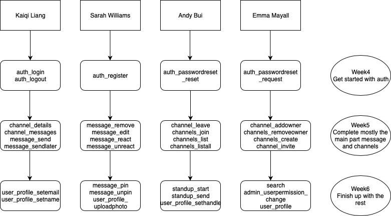

# Plan
## Work Plan
* Continue to have meeting (standups) at least twice a week and do asynchronous standups online 
* As more spec information comes out we will also be closely communicating in meetings to make sure we all have the same understanding of the components of the assignment
* We will be focusing on Test Driven Development, continually working between writing functions, testing and updating the tests we wrote in iteration 1
* Time wise, as there are 32 functions, we will be allocating working on approximately 8 functions each, with the aim to get 2-3 functions finished individually each week

## Software tools to use in the second iteration
* Use task board → add user stories → add functions under user stories to solve user stories. Continually check back with the task board to see what other members of the group are working on and where people may need help. Make use of the to-do and doing labels to communicate this. 
* Gitlab → task board, issues, labels. After iteration 1 all the test functions are in the close list, and all the user stories are in the backlog. As soon as iteration 2 starts the user stories will be moved to the TODO list and while we are working on them we will move them to the DOING list. As soon as we finish working on them they will be closed.
* Pair programming for difficult function implementations
* Continue to use google docs to work on the written aspects of the assignment whilst all members are contributing, e.g. writing reflections and plans together
* Using git - add, commit, push, branches → write accurate git messages using imperative verbs to start each message. Never push from local master, always create a new branch and push to that branch over GitLab. Never merge to master locally, always create a merge request over GitLab and let other members in the group to have a look and then do the merging.
